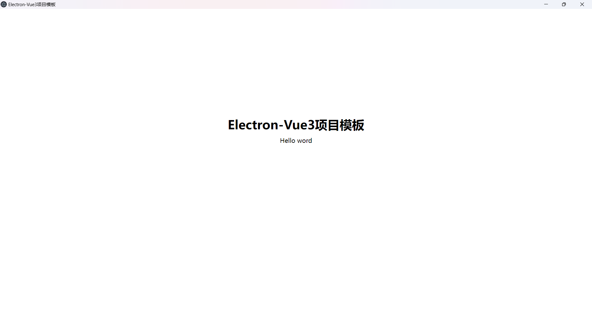

# Electron-Vue3项目模板

## 项目描述

搭建Electron+Vue3项目模板，可帮助前端开发者快速搭建Electron+Vue3的项目，本项目是在[electron-vite-vue](https://github.com/electron-vite/electron-vite-vue)上集成了前端常用的一些技术框架，例如Pinia、Axios、Sass、Typescript、Element-plus、Electron-log、sqlite3等技术，并且对Axios和Electron-log进行了二次封装。

如果觉得不错，麻烦给个Star吧(#^.^#)



## 下载项目

### 基础环境

* Node:  18.0或更高版本

**1、克隆项目**

```
git clone https://gitee.com/anyaoqi/electron-vue3.git
```

**2、下载依赖**

```
npm install 
或
pnpm install
```

**3、运行项目**

```
npm run dev
```

## 技术框架

### **基础框架：[electron-vite-vue](https://github.com/electron-vite/electron-vite-vue)**

    官网地址：https://electron-vite.github.io/

    github地址：https://github.com/electron-vite/electron-vite-vue

### 技术栈

* [Vue3](https://cn.vuejs.org/)
* [Electron](https://www.electronjs.org/zh/docs/latest/)
* [Vue-router](https://router.vuejs.org/zh/)
* [Pinia](https://pinia.vuejs.org/zh/getting-started.html)
* [Axios](https://www.axios-http.cn/)
* [Vite](https://cn.vitejs.dev/)
* [Sass](https://www.sass.hk/)
* [TypeScript](https://www.tslang.cn/index.html)
* [Vueuse](https://vueuse.org/)
* [Element-plus](https://element-plus.org/zh-CN/component/button.html)
* 本地数据库：[Sqlite3](https://github.com/TryGhost/node-sqlite3)
* 本地日志：[electron-log](https://github.com/megahertz/electron-log)

## 目录介绍

* **electron** 主进程
  * electron\database 数据库相关
  * electron\preload.ts  预加载文件
  * electron\main.ts  主进程入口
  * electron\logger.ts 日志工具封装
* **src** 渲染进程
  * src\pages  页面
  * src\components 公共组件
  * src\router  路由
  * src\pinia  状态管理
  * src\styles  全局样式
  * src\apis  接口
  * src\utils  常用工具
* **types**  数据类型
* **config** 全局配置
* **public** 静态资源
* **release** Electron打包输出
* **dist** Vue打包输出
* **vite.config.ts** Vite配置
* **electron-builder.js** 打包配置
* **tsconfig.json** TypeScript配置
* **binding_sqlite3** sqlite编译文件

## 工具封装

### electron-log日志封装

主进程：electron\logger.ts

渲染进程：src\utils\logger.ts

### axios封装

文件位置：src\apis\axios.ts

### 日志

* 日志位置：C:\Users\\username\AppData\Roaming\electron-vue3\logs

### 本地数据库-sqlite

* sqlite数据库：C:\Users\\username\AppData\Roaming\electron-vue3\database.db

## 项目命令

#### 启动：npm run dev

开发环境启动项目

#### 打包：npm run build

生产环境打包项目

#### 预览：npm run preview

在浏览器中预览查看项目
